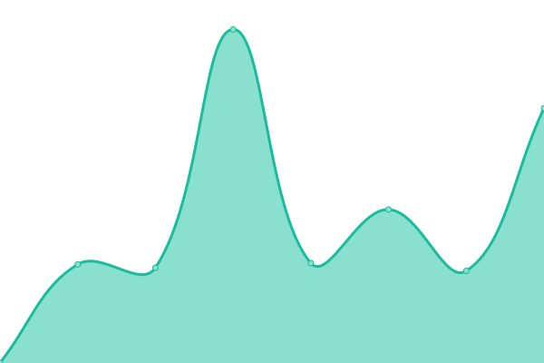
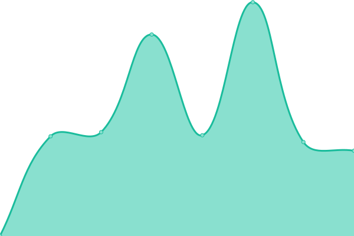

# [📈 Live Status](https://Nau-media-AG.github.io/uptime): <!--live status--> **🟩 All systems operational**

This repository contains the open-source uptime monitor and status page for [Nau media AG](https://www.nau.ch), powered by [Upptime](https://github.com/upptime/upptime).

With [Upptime](https://upptime.js.org), you can get your own unlimited and free uptime monitor and status page, powered entirely by a GitHub repository. We use [Issues](https://github.com/Nau-media-AG/uptime/issues) as incident reports, [Actions](https://github.com/Nau-media-AG/uptime/actions) as uptime monitors, and [Pages](https://Nau-media-AG.github.io/uptime) for the status page.

<!--start: status pages-->
<!-- This summary is generated by Upptime (https://github.com/upptime/upptime) -->
<!-- Do not edit this manually, your changes will be overwritten -->
<!-- prettier-ignore -->
| URL | Status | History | Response Time | Uptime |
| --- | ------ | ------- | ------------- | ------ |
|  [Nau](https://www.nau.ch) | 🟩 Up | [nau.yml](https://github.com/Nau-media-AG/uptime/commits/HEAD/history/nau.yml) | 

 1202ms
     
 | 

<a href="https://Nau-media-AG.github.io/uptime/history/nau">100.00%</a>
    

|  [API Ping](https://api.nau.ch/monitoring/ping) | 🟩 Up | [api-ping.yml](https://github.com/Nau-media-AG/uptime/commits/HEAD/history/api-ping.yml) | 

 544ms
     
 | 

<a href="https://Nau-media-AG.github.io/uptime/history/api-ping">100.00%</a>
    

|  [API Frontpage](https://api.nau.ch/v3/frontpage) | 🟩 Up | [api-frontpage.yml](https://github.com/Nau-media-AG/uptime/commits/HEAD/history/api-frontpage.yml) | 

 453ms
     
 | 

<a href="https://Nau-media-AG.github.io/uptime/history/api-frontpage">100.00%</a>
    

|  [Nau Health](https://health.nau.ch) | 🟩 Up | [nau-health.yml](https://github.com/Nau-media-AG/uptime/commits/HEAD/history/nau-health.yml) | 

 1020ms
     
 | 

<a href="https://Nau-media-AG.github.io/uptime/history/nau-health">100.00%</a>
    

|  [Nau Living](https://living.nau.ch) | 🟩 Up | [nau-living.yml](https://github.com/Nau-media-AG/uptime/commits/HEAD/history/nau-living.yml) | 

 1100ms
     
 | 

<a href="https://Nau-media-AG.github.io/uptime/history/nau-living">100.00%</a>
    

|  [Nau Liebe](https://liebe.nau.ch) | 🟩 Up | [nau-liebe.yml](https://github.com/Nau-media-AG/uptime/commits/HEAD/history/nau-liebe.yml) | 

 1077ms
     
 | 

<a href="https://Nau-media-AG.github.io/uptime/history/nau-liebe">100.00%</a>
    

|  [Nau Luxury](https://luxury.nau.ch) | 🟩 Up | [nau-luxury.yml](https://github.com/Nau-media-AG/uptime/commits/HEAD/history/nau-luxury.yml) | 

 1512ms
     
 | 

<a href="https://Nau-media-AG.github.io/uptime/history/nau-luxury">100.00%</a>
    

|  [Nau Family](https://family.nau.ch) | 🟩 Up | [nau-family.yml](https://github.com/Nau-media-AG/uptime/commits/HEAD/history/nau-family.yml) | 

 1076ms
     
 | 

<a href="https://Nau-media-AG.github.io/uptime/history/nau-family">99.79%</a>
    

|  [Nau Food](https://food.nau.ch) | 🟩 Up | [nau-food.yml](https://github.com/Nau-media-AG/uptime/commits/HEAD/history/nau-food.yml) | 

 915ms
     
 | 

<a href="https://Nau-media-AG.github.io/uptime/history/nau-food">100.00%</a>
    

|  [Nau Tiere](https://tiere.nau.ch) | 🟩 Up | [nau-tiere.yml](https://github.com/Nau-media-AG/uptime/commits/HEAD/history/nau-tiere.yml) | 

 1080ms
     
 | 

<a href="https://Nau-media-AG.github.io/uptime/history/nau-tiere">100.00%</a>
    

|  [Nau Travel](https://travel.nau.ch) | 🟩 Up | [nau-travel.yml](https://github.com/Nau-media-AG/uptime/commits/HEAD/history/nau-travel.yml) | 

 892ms
     
 | 

<a href="https://Nau-media-AG.github.io/uptime/history/nau-travel">100.00%</a>
    

|  [Nau Automobile](https://automobile.nau.ch) | 🟩 Up | [nau-automobile.yml](https://github.com/Nau-media-AG/uptime/commits/HEAD/history/nau-automobile.yml) | 

 901ms
     
 | 

<a href="https://Nau-media-AG.github.io/uptime/history/nau-automobile">99.03%</a>
    

|  [Nau Techtrends](https://techtrends.nau.ch) | 🟩 Up | [nau-techtrends.yml](https://github.com/Nau-media-AG/uptime/commits/HEAD/history/nau-techtrends.yml) | 

 1276ms
     
 | 

<a href="https://Nau-media-AG.github.io/uptime/history/nau-techtrends">100.00%</a>
    

|  [Nau Beauty](https://beauty.nau.ch) | 🟩 Up | [nau-beauty.yml](https://github.com/Nau-media-AG/uptime/commits/HEAD/history/nau-beauty.yml) | 

 952ms
     
 | 

<a href="https://Nau-media-AG.github.io/uptime/history/nau-beauty">99.13%</a>
    

|  [Analytics](https://t.nau.ch) | 🟩 Up | [analytics.yml](https://github.com/Nau-media-AG/uptime/commits/HEAD/history/analytics.yml) | 

 437ms
     
 | 

<a href="https://Nau-media-AG.github.io/uptime/history/analytics">100.00%</a>
    

|  [Nau Media AG](https://nau-media.ch) | 🟩 Up | [nau-media-ag.yml](https://github.com/Nau-media-AG/uptime/commits/HEAD/history/nau-media-ag.yml) | 

 855ms
     
 | 

<a href="https://Nau-media-AG.github.io/uptime/history/nau-media-ag">100.00%</a>
    

|  [Nau Bern](https://bern.nau.ch) | 🟩 Up | [nau-bern.yml](https://github.com/Nau-media-AG/uptime/commits/HEAD/history/nau-bern.yml) | 

 991ms
     
 | 

<a href="https://Nau-media-AG.github.io/uptime/history/nau-bern">100.00%</a>
    

|  [Nau Luzern](https://luzern.nau.ch) | 🟩 Up | [nau-luzern.yml](https://github.com/Nau-media-AG/uptime/commits/HEAD/history/nau-luzern.yml) | 

 951ms
     
 | 

<a href="https://Nau-media-AG.github.io/uptime/history/nau-luzern">100.00%</a>
    

|  [Nau Zürich](https://zurich.nau.ch) | 🟩 Up | [nau-zuerich.yml](https://github.com/Nau-media-AG/uptime/commits/HEAD/history/nau-zuerich.yml) | 

 1018ms
     
 | 

<a href="https://Nau-media-AG.github.io/uptime/history/nau-zuerich">100.00%</a>
    

|  [Nau Basel](https://basel.nau.ch) | 🟩 Up | [nau-basel.yml](https://github.com/Nau-media-AG/uptime/commits/HEAD/history/nau-basel.yml) | 

 921ms
     
 | 

<a href="https://Nau-media-AG.github.io/uptime/history/nau-basel">100.00%</a>
    

|  [Nau Aargau](https://aargau.nau.ch) | 🟩 Up | [nau-aargau.yml](https://github.com/Nau-media-AG/uptime/commits/HEAD/history/nau-aargau.yml) | 

 980ms
     
 | 

<a href="https://Nau-media-AG.github.io/uptime/history/nau-aargau">100.00%</a>
    

|  [Nau Ost](https://ost.nau.ch) | 🟩 Up | [nau-ost.yml](https://github.com/Nau-media-AG/uptime/commits/HEAD/history/nau-ost.yml) | 

 952ms
     
 | 

<a href="https://Nau-media-AG.github.io/uptime/history/nau-ost">100.00%</a>
    

|  [Nau Bern API](https://api.nau.ch/region-pages/pages?region=bern&path=/) | 🟩 Up | [nau-bern-api.yml](https://github.com/Nau-media-AG/uptime/commits/HEAD/history/nau-bern-api.yml) | 

 697ms
     
 | 

<a href="https://Nau-media-AG.github.io/uptime/history/nau-bern-api">100.00%</a>
    

<!--end: status pages-->

[**Visit our status website →**](https://Nau-media-AG.github.io/uptime)

## 📄 License

- Powered by: [Upptime](https://github.com/upptime/upptime)
- Code: [MIT](./LICENSE) © [Anand Chowdhary](https://anandchowdhary.com), supported by [Pabio](https://pabio.com)
- Data in the `./history` directory: [Open Database License](https://opendatacommons.org/licenses/odbl/1-0/)
